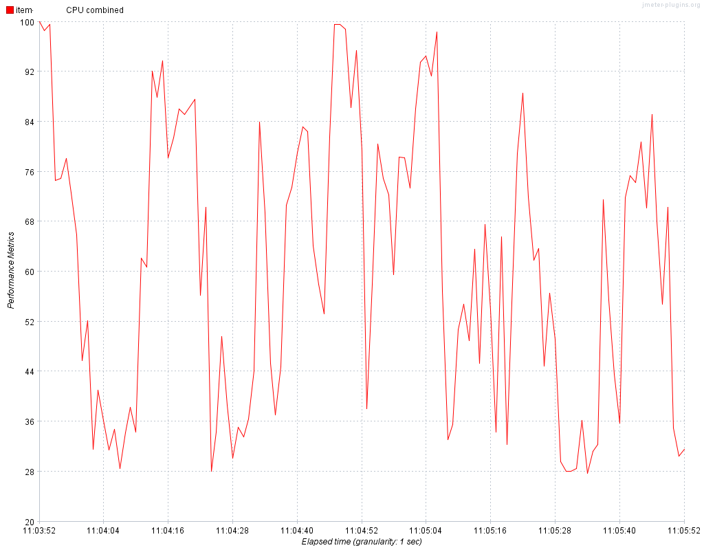
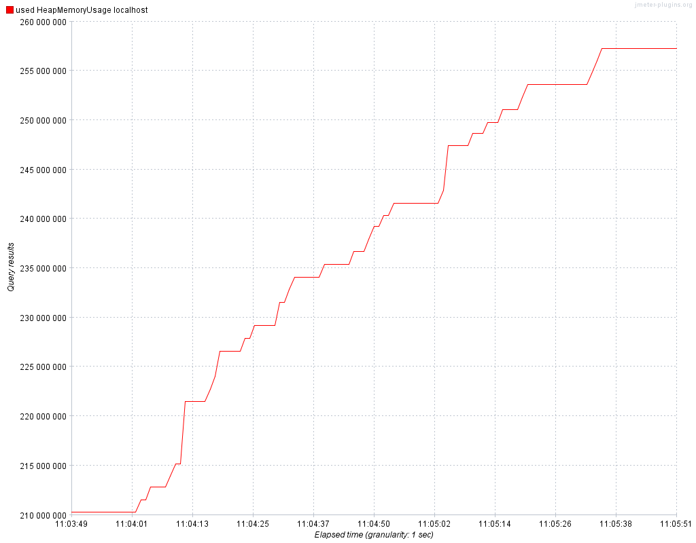
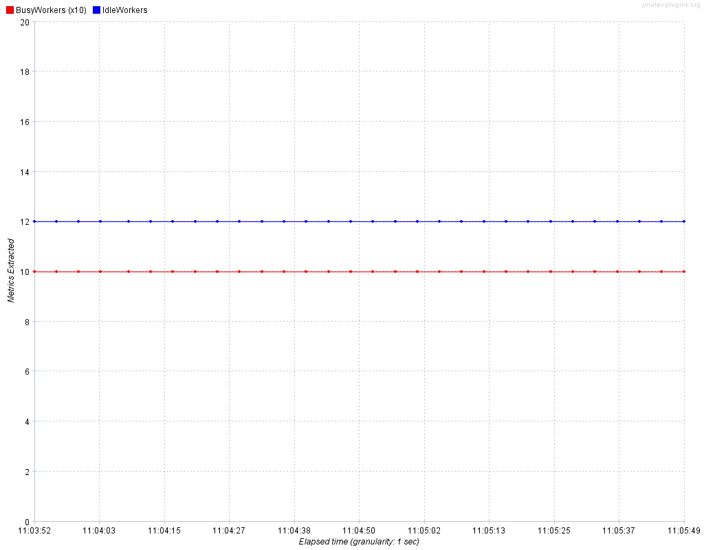

# jmeter-graph-tool-maven-plugin

A maven plugin to create graphs using the **JMeter Plugins CMDRunner** from JMeter result files (\*.jtl or \*.csv) or using **Filter Results Tool**.

See [https://jmeter-plugins.org/wiki/JMeterPluginsCMD/](https://jmeter-plugins.org/wiki/JMeterPluginsCMD/) for more informations for graphs and graphs parameters.

See [https://jmeter-plugins.org/wiki/FilterResultsTool/](https://jmeter-plugins.org/wiki/FilterResultsTool/) for more informations for Filter Result Tools.

A fork from project [jmeter-graph-maven-plugin project](https://github.com/codecentric/jmeter-graph-maven-plugin) and renamed project, add 'tool' to the artifactId. With the permission of the old main developper Michael LEX (september 2021).


Global documentation for graphs : [Customizing graphs](https://jmeter-plugins.org/wiki/SettingsPanel/)

Note: DBMon monitoring graph do not work with this version (log library trouble)


## License
See the LICENSE file Apache 2 [https://www.apache.org/licenses/LICENSE-2.0](https://www.apache.org/licenses/LICENSE-2.0)

## Graphs demo created by jmeter-graph-tool-maven-plugin
Some graphs generated with this plugin

Active Threads Over Time with 2 Thread Groups


Response Times Over Time only pages for Thread Group SC01 force Y to 1000 ms


Response Times Over Time only pages for Thread Group SC03 force Y to 1000 ms


Response Codes per Second (http status)


Response Times Percentiles


Synthesis Report filtered with regular expression for label (the plugin creates only csv result file not this table display)


OS Monitoring CPU with PerfMon plugin



JMX Monitoring for Tomcat (JVM Memory with JMXMon plugin)



Apache httpd monitoring with Page Data Extractor plugin




## Usage

The maven groupId, artifactId and version, this plugin is in the **Maven Central Repository**

```xml
<groupId>io.github.vdaburon</groupId>
<artifactId>jmeter-graph-tool-maven-plugin</artifactId>
<version>1.2</version>
```
Just include the plugin in your `pom.xml` and execute `mvn jmeter-graph:create-graph`.

```xml
<project>
    <!-- ... -->
    <build>
        <plugins>
            <plugin>
                <groupId>io.github.vdaburon</groupId>
                <artifactId>jmeter-graph-tool-maven-plugin</artifactId>
                <version>1.2</version>
                <configuration>
                    <!-- see Filter Results Tool in jmeter-plugins.org -->
                    <filterResultsTool>
                        <filterResultsParam>
                            <inputFile>${project.build.directory}/jmeter/results/gestdoc_sc01_menu_local_monit.csv</inputFile>
                            <outputFile>${project.build.directory}/jmeter/results/gestdoc_sc01_menu_regex_filtred.csv</outputFile>
                            <successFilter>false</successFilter>
                            <includeLabels>0.*</includeLabels>
                            <includeLabelRegex>true</includeLabelRegex>
                        </filterResultsParam>
                        <filterResultsParam>
                            <inputFile>${project.build.directory}/jmeter/results/gestdoc_sc01_menu_local_monit.csv</inputFile>
                            <outputFile>${project.build.directory}/jmeter/results/gestdoc_sc01_menu_offset_filtred.jtl</outputFile>
                            <successFilter>false</successFilter>
                            <startOffset>2</startOffset>
                            <endOffset>20</endOffset>
                            <saveAsXml>true</saveAsXml>
                        </filterResultsParam>
                    </filterResultsTool>
                    <graphs>
                      <!-- see JMeterPluginsCMD Command Line Tool in jmeter-plugins.org -->
                        <graph>
                            <pluginType>ResponseTimesOverTime</pluginType>
                            <inputFile>${project.build.directory}/jmeter/results/gestdoc_sc01_menu_local_monit.csv</inputFile>
                            <generatePng>${project.build.directory}/jmeter/results/ResponseTimesOverTime.png</generatePng>
                            <width>800</width>
                            <height>600</height>
                            <limitRows>50</limitRows>
                            <relativeTimes>no</relativeTimes>
                            <paintGradient>no</paintGradient>
                            <startOffset>2</startOffset>
                            <endOffset>20</endOffset>
                            <includeLabels>0.*</includeLabels>
                            <includeLabelRegex>true</includeLabelRegex>
                            <forceY>1000</forceY>
                            <autoScale>no</autoScale>
                            <lineWeight>2</lineWeight>
                        </graph>
                        <graph>
                            <inputFile>${project.build.directory}/jmeter/results/gestdoc_sc01_menu_local_monit.csv</inputFile>
                            <pluginType>TransactionsPerSecond</pluginType>
                            <width>800</width>
                            <height>600</height>
                            <generatePng>${project.build.directory}/jmeter/results/TransactionsPerSecond.png</generatePng>
                            <relativeTimes>no</relativeTimes>
                            <aggregateRows>yes</aggregateRows>
                            <paintGradient>no</paintGradient>
                        </graph>
                        <!-- Page Data Extractor -->
                        <graph>
                            <pluginType>PageDataExtractorOverTime</pluginType>
                            <inputFile>${project.build.directory}/jmeter/results/pde_httpd.jtl</inputFile>
                            <generatePng>${project.build.directory}/jmeter/results/pde_httpd_all_workers.png</generatePng>
                            <extractorRegexps>(BusyWorkers|IdleWorkers):.*{;}[A-Za-z]+:.([0-9]+){;}false{;}true</extractorRegexps>
                            <width>1024</width>
                            <height>800</height>
                            <relativeTimes>no</relativeTimes>
                            <aggregateRows>no</aggregateRows>
                            <paintGradient>no</paintGradient>
                        </graph>
                        <graph>
                            <pluginType>PageDataExtractorOverTime</pluginType>
                            <inputFile>${project.build.directory}/jmeter/results/pde_httpd.jtl</inputFile>
                            <generatePng>${project.build.directory}/jmeter/results/pde_httpd_busy_workers.png</generatePng>
                            <extractorRegexps>(BusyWorkers):.*{;}BusyWorkers:.([0-9]+){;}false{;}true</extractorRegexps>
                            <width>1024</width>
                            <height>800</height>
                            <relativeTimes>no</relativeTimes>
                            <aggregateRows>no</aggregateRows>
                            <paintGradient>no</paintGradient>
                        </graph>
                        <!-- PerfMon -->
                        <graph>
                            <pluginType>PerfMon</pluginType>
                            <inputFile>${project.build.directory}/jmeter/results/perfmon.csv</inputFile>
                            <generatePng>${project.build.directory}/jmeter/results/Perfmon_CPU.png</generatePng>
                            <includeLabels>.*CPU.*</includeLabels>
                            <includeLabelRegex>true</includeLabelRegex>
                            <width>1024</width>
                            <height>800</height>
                            <relativeTimes>no</relativeTimes>
                            <aggregateRows>no</aggregateRows>
                            <paintGradient>no</paintGradient>
                        </graph>
                        <graph>
                            <pluginType>PerfMon</pluginType>
                            <inputFile>${project.build.directory}/jmeter/results/perfmon.csv</inputFile>
                            <generatePng>${project.build.directory}/jmeter/results/Perfmon_Memory.png</generatePng>
                            <includeLabels>.*Memory.*</includeLabels>
                            <includeLabelRegex>true</includeLabelRegex>
                            <width>1024</width>
                            <height>800</height>
                            <relativeTimes>no</relativeTimes>
                            <aggregateRows>no</aggregateRows>
                            <paintGradient>no</paintGradient>
                        </graph>
                        <!-- JMXMon -->
                        <graph>
                            <pluginType>JMXMon</pluginType>
                            <inputFile>${project.build.directory}/jmeter/results/gest_jmx_tomcat.jtl</inputFile>
                            <generatePng>${project.build.directory}/jmeter/results/JMX_memory_jvm.png</generatePng>
                            <includeLabels>used.HeapMemoryUsage.*</includeLabels>
                            <includeLabelRegex>true</includeLabelRegex>
                            <width>1024</width>
                            <height>800</height>
                            <relativeTimes>no</relativeTimes>
                            <aggregateRows>no</aggregateRows>
                            <paintGradient>no</paintGradient>
                        </graph>
                        <graph>
                            <pluginType>JMXMon</pluginType>
                            <inputFile>${project.build.directory}/jmeter/results/gest_jmx_tomcat.jtl</inputFile>
                            <generatePng>${project.build.directory}/jmeter/results/JMX_currentThreadsBusy.png</generatePng>
                            <includeLabels>.*currentThreadsBusy.*</includeLabels>
                            <includeLabelRegex>true</includeLabelRegex>
                            <width>1024</width>
                            <height>800</height>
                            <relativeTimes>no</relativeTimes>
                            <aggregateRows>no</aggregateRows>
                            <paintGradient>no</paintGradient>
                        </graph>
                        <!-- Aggregate report csv -->
                        <graph>
                            <inputFile>${project.build.directory}/jmeter/results/gestdoc_sc01_menu_local_monit.csv</inputFile>
                            <pluginType>AggregateReport</pluginType>
                            <generateCsv>${project.build.directory}/jmeter/results/AggregateReport.csv</generateCsv>
                        </graph>
                        <graph>
                            <inputFile>${project.build.directory}/jmeter/results/gestdoc_sc01_menu_local_monit.csv</inputFile>
                            <pluginType>ResponseCodesPerSecond</pluginType>
                            <width>800</width>
                            <height>600</height>
                            <generatePng>${project.build.directory}/jmeter/results/ResponseCodesPerSecond.png</generatePng>
                            <relativeTimes>no</relativeTimes>
                            <aggregateRows>no</aggregateRows>
                            <paintGradient>no</paintGradient>
                        </graph>
                    </graphs>
                    <!- copy files from directoryTestFiles to MAVEN_PROJECT_DIRECTORY/target/jmeter/bin -->
                    <directoryTestFiles>${project.build.directory}/jmeter/testFiles</directoryTestFiles>
                    <!-- see jmeter-maven-pugins -->
                    <jMeterProcessJVMSettings>
                        <xms>${jvm_xms}</xms>
                        <xmx>${jvm_xmx}</xmx>
                        <arguments>
                            <argument>-Duser.language=en</argument>
                        </arguments>
                    </jMeterProcessJVMSettings>
                    <!-- merge this properties with user.properties file in MAVEN_PROJECT_DIRECTORY/target/jmeter/bin -->
                    <!-- property format = <property_name>property_value</property name> will be property_name=property_value in the user.properties file. E.g. language=en -->
                    <propertiesUser>
                        <language>en</language>
                    </propertiesUser>
            </configuration>
        </plugin>
    </plugins>
  </build>
</project>
```

You can also bind the graph-generation to a maven-phase, e.g. `verify`:

```xml
<project>
  <!-- ... -->
  <build>
    <plugins>
      <plugin>
        <groupId>io.github.vdaburon</groupId>
        <artifactId>jmeter-graph-tool-maven-plugin</artifactId>
        <version>1.2</version>
        <executions>
          <execution>
            <id>create-graphs</id>
            <goals>
              <goal>create-graph</goal>
            </goals>
            <phase>verify</phase>
            <configuration>
              <!-- ... you can declare filterResultsTool here -->
             <graphs>
                <graph>
                    <pluginType>ResponseTimesOverTime</pluginType>
                    <inputFile>${project.build.directory}/jmeter/results/gestdoc_sc01_menu_local_monit.csv</inputFile>
                    <generatePng>${project.build.directory}/jmeter/results/ResponseTimesOverTime.png</generatePng>
                    <width>1024</width>
                    <height>768</height>
                </graph>
                <!-- ... you can declare more <graph> here -->
              </graphs>
            </configuration>
          </execution>
        </execution>
      </plugin>
    </plugins>
  </build>
</project>
```

### Parameters for a graph (depends of the pluginType) :
- inputFile (mandatory)
- pluginType (mandatory)
- width
- height
- generatePng (mandatory depends of the pluginType)
- generateCsv (mandatory depends of the pluginType)
- granulation
- relativeTimes
- aggregateRows
- paintGradient
- paintZeroing
- paintMarkers
- preventOutliers
- limitRows
- forceY
- hideLowCounts
- successFilter
- includeLabels
- excludeLabels
- autoScale
- lineWeight
- extractorRegexps
- includeLabelRegex
- excludeLabelRegex
- startOffset
- endOffset

### List of the graph plugins type
- AggregateReport [more informations](https://jmeter.apache.org/usermanual/component_reference.html#Aggregate_Report)
- SynthesisReport [more informations](https://jmeter-plugins.org/wiki/SynthesisReport/)
- ThreadsStateOverTime [more informations](https://jmeter-plugins.org/wiki/ActiveThreadsOverTime/)
- BytesThroughputOverTime [more informations](https://jmeter-plugins.org/wiki/BytesThroughput/)
- HitsPerSecond [more informations](https://jmeter-plugins.org/wiki/HitsPerSecond/)
- LatenciesOverTime [more informations](https://jmeter-plugins.org/wiki/LatenciesOverTime/)
- PerfMon [more informations](https://jmeter-plugins.org/wiki/PerfMon/)
- DbMon (trouble with this plugin because log library error) [more informations](https://jmeter-plugins.org/wiki/PerfMon/)
- JMXMon [more informations](https://jmeter-plugins.org/wiki/JMXMon/)
- ResponseCodesPerSecond [more informations](https://jmeter-plugins.org/wiki/ResponseCodesPerSecond/)
- ResponseTimesDistribution [more informations](https://jmeter-plugins.org/wiki/RespTimesDistribution/)
- ResponseTimesOverTime [more informations](https://jmeter-plugins.org/wiki/ResponseTimesOverTime/)
- ResponseTimesPercentiles [more informations](https://jmeter-plugins.org/wiki/RespTimePercentiles/)
- ThroughputVsThreads [more informations](https://jmeter-plugins.org/wiki/TransactionThroughputVsThreads/)
- TimesVsThreads [more informations](https://jmeter-plugins.org/wiki/ResponseTimesVsThreads/)
- TransactionsPerSecond [more informations](https://jmeter-plugins.org/wiki/TransactionsPerSecond/)
- PageDataExtractorOverTime [more informations](https://jmeter-plugins.org/wiki/PageDataExtractor/)

### Parameters for a filterResultsTool
- inputFile (path to the file to read)
- outputFile (path to the file to write)
- successFilter (true/false, true : only success samplers, false : all results by default)
- includeLabels (labels list with comma or label with regular expression)
- includeLabelRegex (true/false, true if your label is a regular expression)
- excludeLabels (labels list with comma or label with regular expression)
- excludeLabelRegex (true/false, true if your label is a regular expression))
- startOffset (integer, number of seconds since the start to remove)
- endOffset (integer, number of seconds offset to remove samplers after with value, keep samplers between startOffset and endOffset seconds)
- saveAsXml (true/false, false : CSV format by default)

## user.properties and jmeter.properties
Files in the directory &lt;directoryTestFiles&gt; are **copied** by the **jmeter-graph-tool-maven-plugin** to the build directory &lt;MAVEN_PROJECT_DIRECTORY&gt;/target/jmeter/bin.

You can put your jmeter.properties or your user.properties in the &lt;MAVEN_PROJECT_DIRECTORY&gt;/src/test/jmeter, files will be place by **jmeter-maven-plugin** in &lt;MAVEN_PROJECT_DIRECTORY&gt;/target/jmeter/testFiles (Note : ${project.build.directory} == &lt;MAVEN_PROJECT_DIRECTORY&gt;/target), and declare 


```xml
<directoryTestFiles>${project.build.directory}/jmeter/testFiles</directoryTestFiles>
```

You can also add or replace user properties values with the

```xml
<propertiesUser><propertyName>propertyValue</propertiesUser></propertyName>
E.g. 
<propertiesUser>
    <language>en</language>
</propertiesUser>
will be : language=en in final the user.properties
```
Properties read order :

default jmeter.properties **&lt;** jmeter.properties in &lt;MAVEN_PROJECT_DIRECTORY&gt;/src/test/jmeter or &lt;directoryTestFiles&gt;${project.build.directory}/jmeter/testFiles

default user.properties **&lt;** user.propertes in &lt;MAVEN_PROJECT_DIRECTORY&gt;/src/test/jmeter or &lt;directoryTestFiles&gt;${project.build.directory}/jmeter/testFiles **&lt;** properties declared in the pom.xml under the &lt;propertiesUser&gt;

## JVM Setting
You could change the JVM setting with &lt;jMeterProcessJVMSettings&gt;

- xms Memory Start unit MB<br>
- xmx Memory Max unit MB<br>
and arguments for more JVM configuration

E.g :

```xml
<jMeterProcessJVMSettings> 
    <xms>1024</xms>
    <xmx>2048</xmx>
    <arguments>
        <argument>-Duser.language=en</argument>
    </arguments>
</jMeterProcessJVMSettings>
```

## Compagnion tools
This tools are also used with this maven plugin :

* [JMReportCsvToHtml](https://github.com/vdaburon/JMReportCsvToHtml) Create a html table from report csv file (Report : Aggregate, Summary or Synthesis)
* [CreateHtmlForFilesInDirectory](https://github.com/vdaburon/CreateHtmlForFilesInDirectory) Recursively scans a directory looking for files of different types to generate a link or include the content in the generated html page. Create a little static web site.
* [CreateGitlabWikiPageForFilesInDirectory](https://github.com/vdaburon/CreateGitlabWikiPageForFilesInDirectory) Generating a Gitlab Wiki Page that references or includes various files.
* [JUnitReportKpiJMeterReportCsv](https://github.com/vdaburon/JUnitReportKpiJMeterReportCsv) Read KPI declarations in a file and apply the KPI assertion on a JMeter Report CSV file and generates a result file in JUnit XML format.
* [JUnitReportKpiCompareJMeterReportCsv](https://github.com/vdaburon/JUnitReportKpiCompareJMeterReportCsv) Compare 2 load tests JMeter Report CSV File and create a JUnit Report based on custom Key Performance Indicators (KPIs).
* [JUnitReportKpiJMeterDashboardStats](https://github.com/vdaburon/JUnitReportKpiJMeterDashboardStats) Read KPI declarations in a file and apply the KPI assertion on a JMeter Dashboard Statistics Json file and generates a result file in JUnit XML format.


## Full example 
A full example, use **jmeter-maven-plugin** [see](https://github.com/jmeter-maven-plugin/jmeter-maven-plugin) and **jmeter-graph-tool-maven-plugin**.

<directoryTestFiles>Launch load test and the monitoring (PerfMon, JMXMon, Page Data Extractor), then filter results and generate graphs and Aggregate Report.

Use maven-phase `verify`

```xml
<project xmlns="http://maven.apache.org/POM/4.0.0" xmlns:xsi="http://www.w3.org/2001/XMLSchema-instance"
    xsi:schemaLocation="http://maven.apache.org/POM/4.0.0 https://maven.apache.org/xsd/maven-4.0.0.xsd">
    <modelVersion>4.0.0</modelVersion>
    <groupId>io.github.vdaburon.jmeter</groupId>
    <artifactId>jm_maven</artifactId>
    <version>1.3</version>
    <properties>
        <project.build.sourceEncoding>UTF-8</project.build.sourceEncoding>
        <maven.compiler.source>1.8</maven.compiler.source>
        <maven.compiler.target>1.8</maven.compiler.target>
        <jvm_xms>256</jvm_xms>
        <jvm_xmx>756</jvm_xmx>
        <nb_vusers>20</nb_vusers>
        <duration>180</duration>
    </properties>

    <build>
        <plugins>
                
            <plugin>
                <groupId>com.lazerycode.jmeter</groupId>
                <artifactId>jmeter-maven-plugin</artifactId>
                <version>3.6.1</version>
                <executions>
                    <!-- Generate JMeter configuration -->
                    <execution>
                        <id>configuration</id>
                        <goals>
                            <goal>configure</goal>
                        </goals>
                    </execution>
                    <!-- Run JMeter tests -->
                    <execution>
                        <id>jmeter-tests</id>
                        <goals>
                            <goal>jmeter</goal>
                        </goals>
                    </execution>
                    <!-- Fail build on errors in test 
                    <execution>
                        <id>jmeter-check-results</id>
                        <goals>
                            <goal>results</goal>
                        </goals>
                    </execution>
                    -->
                </executions>
                <configuration>
                    <testPlanLibraries>
                        <!-- add libraries in JMETER_HOME/lib -->
                        <artifact>mysql:mysql-connector-java:8.0.30</artifact>
                    </testPlanLibraries>
                    <jmeterExtensions>
                        <artifact>kg.apc:jmeter-plugins-functions:2.1</artifact>
                        <artifact>kg.apc:jmeter-plugins-casutg:2.9</artifact>
                        <artifact>kg.apc:jmeter-plugins-dummy:0.4</artifact>
                        <artifact>kg.apc:jmeter-plugins-dbmon:0.1</artifact>
                        <artifact>kg.apc:jmeter-plugins-jmxmon:0.3</artifact>
                        <artifact>kg.apc:jmeter-plugins-pde:0.1</artifact>
                        <artifact>kg.apc:jmeter-plugins-perfmon:2.1</artifact>
                        <artifact>kg.apc:jmeter-plugins-graphs-basic:2.0</artifact>
                        <artifact>kg.apc:jmeter-plugins-cmn-jmeter:0.3</artifact>
                    </jmeterExtensions>
                    <excludedArtifacts>
                        <exclusion>commons-pool2:commons-pool2</exclusion>
                    </excludedArtifacts>
                    
                    <!-- The plugin uses some broken dependencies An alternative is to set 
                        this to true and use excludedArtifacts, see below -->
                    <downloadExtensionDependencies>true</downloadExtensionDependencies>
                    <jMeterProcessJVMSettings>
                        <xms>${jvm_xms}</xms>
                        <xmx>${jvm_xmx}</xmx>
                    </jMeterProcessJVMSettings>
                    <propertiesUser>
                        <!-- project directory for this script, dedicated property use in the JMeter script to read csv file for example -->
                        <dirProject>${project.build.directory}/jmeter</dirProject>
                        <!-- nb_users and load test duration could be changed with mvn -Dparam=value, e.g. -Dnb_vusers=10 to replace default value (10 replace 20)-->
                        <nb_vusers>${nb_vusers}</nb_vusers>
                        <duration>${duration}</duration>
                    </propertiesUser>
                    <generateReports>false</generateReports>
                    <testResultsTimestamp>false</testResultsTimestamp>
                    <resultsFileFormat>csv</resultsFileFormat>
                </configuration>
            </plugin>
            <plugin>
                <groupId>io.github.vdaburon</groupId>
                <artifactId>jmeter-graph-tool-maven-plugin</artifactId>
                <version>1.2</version>
                <executions>
                    <execution>
                        <id>create-graphs</id>
                        <goals>
                            <goal>create-graph</goal>
                        </goals>
                        <phase>verify</phase>
                        <configuration>
                            <directoryTestFiles>${project.build.directory}/jmeter/testFiles</directoryTestFiles>
                            <filterResultsTool>
                                <filterResultsParam>
                                    <inputFile>${project.build.directory}/jmeter/results/gestdoc_sc01_menu_local_monit.csv</inputFile>
                                    <outputFile>${project.build.directory}/jmeter/results/gestdoc_sc01_menu_regex_filtred.csv</outputFile>
                                    <successFilter>false</successFilter>
                                    <includeLabels>0.*</includeLabels>
                                    <includeLabelRegex>true</includeLabelRegex>
                                </filterResultsParam>
                                <filterResultsParam>
                                    <inputFile>${project.build.directory}/jmeter/results/gestdoc_sc01_menu_local_monit.csv</inputFile>
                                    <outputFile>${project.build.directory}/jmeter/results/gestdoc_sc01_menu_offset_filtred.jtl</outputFile>
                                    <successFilter>false</successFilter>
                                    <startOffset>2</startOffset>
                                    <endOffset>20</endOffset>
                                    <saveAsXml>true</saveAsXml>
                                </filterResultsParam>
                            </filterResultsTool>
    
                            <graphs>
                                <graph>
                                    <pluginType>AggregateReport</pluginType>
                                    <inputFile>${project.build.directory}/jmeter/results/gestdoc_sc01_menu_local_monit.csv</inputFile>
                                    <generateCsv>${project.build.directory}/jmeter/results/AggregateReport.csv</generateCsv>
                                </graph>
      
                                <graph>
                                    <pluginType>ResponseTimesOverTime</pluginType>
                                    <inputFile>${project.build.directory}/jmeter/results/gestdoc_sc01_menu_local_monit.csv</inputFile>
                                    <generatePng>${project.build.directory}/jmeter/results/ResponseTimesOverTime.png</generatePng>
                                    <width>800</width>
                                    <height>600</height>
                                    <limitRows>50</limitRows>
                                    <relativeTimes>no</relativeTimes>
                                    <paintGradient>no</paintGradient>
                                    <startOffset>2</startOffset>
                                    <endOffset>20</endOffset>
                                    <includeLabels>0.*</includeLabels>
                                    <includeLabelRegex>true</includeLabelRegex>
                                    <forceY>1000</forceY>
                                    <autoScale>no</autoScale>
                                    <lineWeight>4</lineWeight>
                                </graph>
      
                                <graph>
                                    <pluginType>LatenciesOverTime</pluginType>
                                    <inputFile>${project.build.directory}/jmeter/results/gestdoc_sc01_menu_local_monit.csv</inputFile>
                                    <width>800</width>
                                    <height>600</height>
                                    <generatePng>${project.build.directory}/jmeter/results/LatenciesOverTime.png</generatePng>
                                    <relativeTimes>no</relativeTimes>
                                    <paintGradient>no</paintGradient>
                                </graph>
                                <graph>
                                    <pluginType>ResponseCodesPerSecond</pluginType>
                                    <inputFile>${project.build.directory}/jmeter/results/gestdoc_sc01_menu_local_monit.csv</inputFile>
                                    <width>800</width>
                                    <height>600</height>
                                    <generatePng>${project.build.directory}/jmeter/results/ResponseCodesPerSecond.png</generatePng>
                                    <relativeTimes>no</relativeTimes>
                                    <paintGradient>no</paintGradient>
                                </graph>
                                <graph>
                                    <pluginType>ResponseTimesDistribution</pluginType>
                                    <inputFile>${project.build.directory}/jmeter/results/gestdoc_sc01_menu_local_monit.csv</inputFile>
                                    <width>800</width>
                                    <height>600</height>
                                    <generatePng>${project.build.directory}/jmeter/results/ResponseTimesDistribution.png</generatePng>
                                    <paintGradient>no</paintGradient>
                                </graph>
                                <graph>
                                    <pluginType>ResponseTimesOverTime</pluginType>
                                    <inputFile>${project.build.directory}/jmeter/results/gestdoc_sc01_menu_local_monit.csv</inputFile>
                                    <width>800</width>
                                    <height>600</height>
                                    <generatePng>${project.build.directory}/jmeter/results/ResponseTimesOverTime.png</generatePng>
                                    <relativeTimes>no</relativeTimes>
                                    <paintGradient>no</paintGradient>
                                </graph>
                                <graph>
                                    <pluginType>ResponseTimesPercentiles</pluginType>
                                    <inputFile>${project.build.directory}/jmeter/results/gestdoc_sc01_menu_local_monit.csv</inputFile>
                                    <width>800</width>
                                    <height>600</height>
                                    <generatePng>${project.build.directory}/jmeter/results/ResponseTimesPercentiles.png</generatePng>
                                    <paintGradient>no</paintGradient>
                                </graph>
                                <graph>
                                    <pluginType>ThroughputVsThreads</pluginType>
                                    <inputFile>${project.build.directory}/jmeter/results/gestdoc_sc01_menu_local_monit.csv</inputFile>
                                    <width>800</width>
                                    <height>600</height>
                                    <generatePng>${project.build.directory}/jmeter/results/ThroughputVsThreads.png</generatePng>
                                    <paintGradient>no</paintGradient>
                                </graph>
                                <graph>
                                    <pluginType>TimesVsThreads</pluginType>
                                    <inputFile>${project.build.directory}/jmeter/results/gestdoc_sc01_menu_local_monit.csv</inputFile>
                                    <width>800</width>
                                    <height>600</height>
                                    <generatePng>${project.build.directory}/jmeter/results/TimesVsThreads.png</generatePng>
                                    <paintGradient>no</paintGradient>
                                </graph>
                                <graph>
                                    <pluginType>TransactionsPerSecond</pluginType>
                                    <inputFile>${project.build.directory}/jmeter/results/gestdoc_sc01_menu_local_monit.csv</inputFile>
                                    <width>800</width>
                                    <height>600</height>
                                    <generatePng>${project.build.directory}/jmeter/results/TransactionsPerSecond.png</generatePng>
                                    <relativeTimes>no</relativeTimes>
                                    <aggregateRows>yes</aggregateRows>
                                    <paintGradient>no</paintGradient>
                                </graph>
                                <!-- graphs from monitoring -->
                                <graph>
                                     <pluginType>PageDataExtractorOverTime</pluginType>
                                    <inputFile>${project.build.directory}/jmeter/results/pde_httpd.jtl</inputFile>
                                    <generatePng>${project.build.directory}/jmeter/results/pde_httpd_all_workers.png</generatePng>
                                    <extractorRegexps>(BusyWorkers|IdleWorkers):.*{;}[A-Za-z]+:.([0-9]+){;}false{;}true</extractorRegexps>
                                    <width>1024</width>
                                    <height>800</height>
                                    <relativeTimes>no</relativeTimes>
                                    <paintGradient>no</paintGradient>
                                </graph>
                                <graph>
                                    <pluginType>PageDataExtractorOverTime</pluginType>
                                    <inputFile>${project.build.directory}/jmeter/results/pde_httpd.jtl</inputFile>
                                    <generatePng>${project.build.directory}/jmeter/results/pde_httpd_busy_workers.png</generatePng>
                                    <extractorRegexps>(BusyWorkers):.*{;}BusyWorkers:.([0-9]+){;}false{;}true</extractorRegexps>
                                    <width>1024</width>
                                    <height>800</height>
                                    <relativeTimes>no</relativeTimes>
                                    <paintGradient>no</paintGradient>
                                </graph>
                                <graph>
                                    <pluginType>PerfMon</pluginType>
                                    <inputFile>${project.build.directory}/jmeter/results/perfmon.csv</inputFile>
                                    <generatePng>${project.build.directory}/jmeter/results/Perfmon_CPU.png</generatePng>
                                    <includeLabels>.*CPU.*</includeLabels>
                                    <includeLabelRegex>true</includeLabelRegex>
                                    <width>1024</width>
                                    <height>800</height>
                                    <relativeTimes>no</relativeTimes>
                                    <paintGradient>no</paintGradient>
                                </graph>
                                <graph>
                                    <pluginType>PerfMon</pluginType>
                                    <inputFile>${project.build.directory}/jmeter/results/perfmon.csv</inputFile>
                                    <generatePng>${project.build.directory}/jmeter/results/Perfmon_Memory.png</generatePng>
                                    <includeLabels>.*Memory.*</includeLabels>
                                    <includeLabelRegex>true</includeLabelRegex>
                                    <width>1024</width>
                                    <height>800</height>
                                    <relativeTimes>no</relativeTimes>
                                    <paintGradient>no</paintGradient>
                                </graph>
                                <graph>
                                    <pluginType>JMXMon</pluginType>
                                    <inputFile>${project.build.directory}/jmeter/results/gest_jmx_tomcat.jtl</inputFile>
                                    <generatePng>${project.build.directory}/jmeter/results/JMX_memory_jvm.png</generatePng>
                                    <includeLabels>used.HeapMemoryUsage.*</includeLabels>
                                    <includeLabelRegex>true</includeLabelRegex>
                                    <width>1024</width>
                                    <height>800</height>
                                    <relativeTimes>no</relativeTimes>
                                    <paintGradient>no</paintGradient>
                                </graph>
                                <graph>
                                    <pluginType>JMXMon</pluginType>
                                    <inputFile>${project.build.directory}/jmeter/results/gest_jmx_tomcat.jtl</inputFile>
                                    <generatePng>${project.build.directory}/jmeter/results/JMX_currentThreadsBusy.png</generatePng>
                                    <includeLabels>.*currentThreadsBusy.*</includeLabels>
                                    <includeLabelRegex>true</includeLabelRegex>
                                    <width>1024</width>
                                    <height>800</height>
                                    <relativeTimes>no</relativeTimes>
                                    <paintGradient>no</paintGradient>
                                </graph>
                             </graphs>

                            <jMeterProcessJVMSettings>
                                <xms>${jvm_xms}</xms>
                                <xmx>${jvm_xmx}</xmx>
                                <arguments>
                                    <argument>-Duser.language=en</argument>
                                </arguments>
                            </jMeterProcessJVMSettings>
                        </configuration>
                    </execution>
                </executions>
            </plugin>
        </plugins>
    </build>

</project>
```
